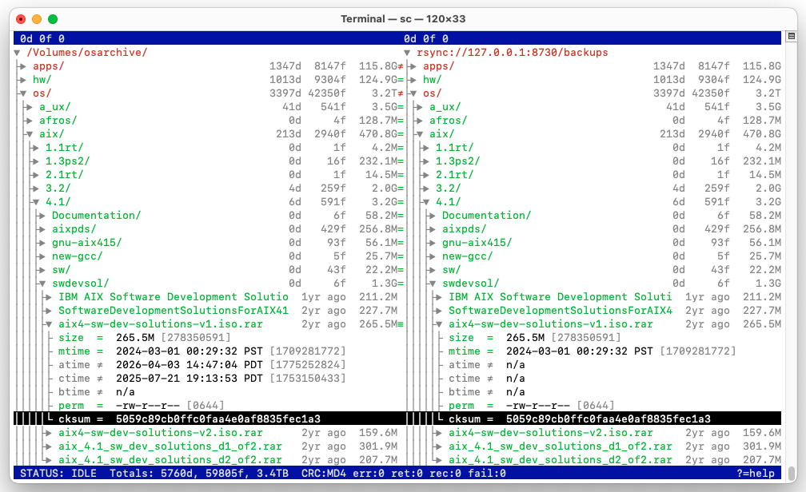

# Sync Commander

A tool for manual comparison, inspection, verification and troubleshooting of file/directory tree synchronization. Like Norton Commander or Midnight Commander but for sync.

- Out of band verification and inspection of dir sync tree.
- Manual comparison, touch up and maintenance.
- Troubleshooting, debugging sync issues.
- Ad hoc downloads/uploads. Touch up.
- Remote checksum generation and comparison.

## Features

- Manual Rsync / Rclone by hand.
- Remote checksum calculation via variety of protocols.
- Parallel copies.
- Batch copies for small files.

## Supported protocols and checksums

| Protocol | Checksum |
| --- | --- |
| Local dir including remote mounts | SHA/MD5 |
| ftp:// ftps:// ftpes:// with implicit/explicit TLS | XCRC, XSHA, HASH |
| sftp:// scp:// ssh:// | SHA/MD5 (over ssh) |
| rsync://, rsync+ssh:// | Rsync MD4 (internal), SHA/MD5 (over ssh) |
| webdav://, webdavs:// | MD5/SHA1 (`rclone --etag-hash`) |
| restic://, restics:// | SHA256 |

## Server examples

- `rclone serve webdav --etag-hash md5`
- `rclone serve restic`
